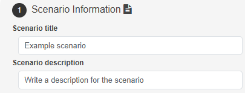
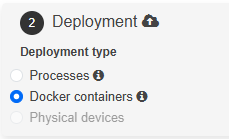
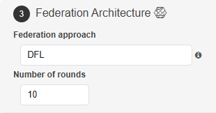
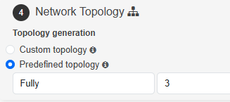
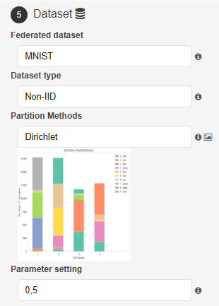
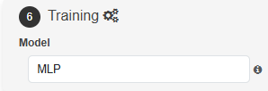
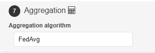

# User Guide

In this section, we will explain how to use the NEBULA Platform

## Table of contents

-   [Scenario Deployment](#deployment-of-scenarios)
-   [NEBULA Dashboard](#nebula-dashboard)
-   [NEBULA realtime-metrics](#nebula-realtime-metrics)
-   [NEBULA monitor](#nebula-monitor)

## Deployment of Scenarios
Here you can define the different parameters used to deploy the federation of nodes
### 1. Scenario Information
  
**Provide a title and a description for your scenario.**

### 2. Deployment
  
**Choose the type of deployment: processes, Docker containers, or physical devices.**

### 3. Federation Architecture
  
**Configure the federation approach (e.g., DFL) and the number of rounds.**

### 4. Network Topology
  
**Select between a custom topology or a predefined one.**

### 5. Dataset
  
**Choose the federated dataset, its type, partition methods, and parameter settings.**

### 6. Training
  
**Define the model to be used for training.**

### 7. Aggregation
  
**Set up the aggregation algorithm, such as FedAvg.**

## NEBULA Dashboard  

The NEBULA Dashboard provides an overview of the current federation scenarios and allows users to manage and monitor them effectively. Below is an explanation of the key components and buttons visible on the dashboard.

### Current Scenario Status  
- **Scenario name:** Displays the name of the currently running scenario.  
- **Scenario title and description:** Shows the title and description provided during the scenario creation.  
- **Scenario start time:** Indicates when the scenario was initiated.  

#### Buttons:  
- **Deploy new scenario:**  
  Use this button to create and deploy a new federation scenario. It redirects you to the scenario configuration interface.  
- **Compare scenarios:**  
  Allows you to compare the results of completed scenarios. Useful for analyzing performance differences.

### Scenarios in the Database  
This section provides a table summarizing all scenarios in the database.  

#### Columns:  
- **User:** Shows the user who created the scenario.  
- **Title:** Displays the scenario title.  
- **Start time:** Indicates when the scenario was started.  
- **Model:** The model being used for training (e.g., MLP).  
- **Dataset:** The dataset used in the scenario (e.g., MNIST).  
- **Rounds:** The number of training rounds configured.  
- **Status:** Indicates whether the scenario is running, stopped, or completed.  

#### Buttons in the "Action" Column:  
- **Monitor:**  
  Opens the monitoring interface for the selected scenario, showing metrics like accuracy and loss over time.  

- **Real-time metrics:**  
  Displays live updates of training metrics while the scenario is running.  

- **Save Note:**  
  Allows you to save custom notes or observations related to the scenario for future reference.

- **Scenario Config:**  
  Opens the configuration details of the selected scenario, allowing you to review the parameters used during its creation.    

- **Stop scenario:**  
  Immediately halts the execution of the selected scenario.

## NEBULA Realtime Metrics

#### **Available Tabs**  
1. **Time Series:**  

   - Displays graphs of metrics recorded during the execution.  
   - Each graph is interactive, enabling comparison of metrics across participants or scenarios.  
   - Main options:  
     - **Filters:** Use regex to select the runs to display.  
     - **Axes:** Configure the horizontal axis (step, relative, wall).  
     - **Smoothing:** Adjust the curve using a slider.

   - Example metrics:  
     - *Test (Global)/Accuracy*  
     - *Test (Global)/F1Score*

2. **Scalars:**  

   - Similar to the Time Series tab but focused on global scalar values, such as accuracy and loss over iterations.

3. **Images (Confusion Matrix):**  

   - Displays the confusion matrix generated during the execution.  
   - Used to evaluate the classification performance of the models.  
   - Each matrix is specific to a participant or global metrics.

#### **Configuration Options:**  
- **Smoothing:** Adjusts the visualization of the curves.  
- **Ignore outliers:** Excludes outlier values in the graphs for a clearer representation.  
- **Card size:** Modifies the size of the graphs.

## NEBULA Monitor

### Scenario Information  
This section provides a summary of the scenario's metadata and controls for managing it.  

- **Title:** Displays the name of the scenario.  
- **Description:** A brief description of the scenario's purpose or configuration.  
- **Status:** Indicates whether the scenario is *Running* or *Stopped*.  

### Buttons  
- **Stop Scenario:** Halts the execution of the currently running scenario.  
- **Real-time Metrics:** Redirects you to the real-time metrics dashboard to monitor the scenario's performance.  
- **Download Logs/Metrics:** Downloads logs and metrics data for further analysis.  
- **Download Metrics:** Allows you to save metric data separately in your local environment.  

### Nodes in the Database  
This table summarizes all nodes participating in the scenario.  

### Columns  
- **UID:** A unique identifier for each node.  
- **IDX:** The index of the node in the scenario.  
- **IP:** The IP address of the node.  
- **Role:** Indicates the role of the node (e.g., aggregator).  
- **Round:** Specifies the current round of operation for the node.  
- **Status:** Displays whether the node is *Online* or *Offline*.  
- **Logs:** A button to access detailed logs for each node.  

### Map  
A real-time visualization of the nodes and their interactions displayed on a map.  

- **Purpose:** Provides a geographical representation of node distributions and connections.  
- **Features:**  
  - Interactive map with zoom and pan functionality.  
  - Visualizes active nodes and their interactions with connecting lines.  

### Topology  
This section illustrates the network topology of the scenario.  

- **Purpose:** Shows the relationships and interactions between nodes in a structured topology.  
- **Download:** You can click the "here" link to download a detailed representation of the topology.  
